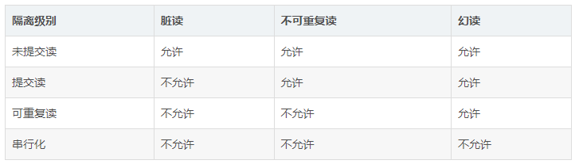

# 事务

## 一、定义

数据库事务( transaction)是访问并可能操作各种数据项的一个数据库操作序列，这些操作要么全部执行,要么全部不执行，是一个不可分割的工作单位。事务由事务开始与事务结束之间执行的全部数据库操作组成。

## 二、四大特性

原子性：原子性是指包含事务的操作要么全部执行成功，要么全部失败回滚。

一致性：一致性指事务在执行前后状态是一致的。

隔离性：一个事务所进行的修改在最终提交之前，对其他事务是不可见的。

持久性：数据一旦提交，其所作的修改将永久地保存到数据库中。

## 三、数据库的并发一致性问题

当多个事务并发执行时，可能会出现以下问题：

脏读：事务A更新了数据，但还没有提交，这时事务B读取到事务A更新后的数据，然后事务A回滚了，事务B读取到的数据就成为脏数据了。

不可重复读：事务A对数据进行多次读取，事务B在事务A多次读取的过程中执行了更新操作并提交了，导致事务A多次读取到的数据并不一致。

幻读：事务A在读取数据后，事务B向事务A读取的数据中插入了几条数据，事务A再次读取数据时发现多了几条数据，和之前读取的数据不一致。

丢失修改：事务A和事务B都对同一个数据进行修改，事务A先修改，事务B随后修改，事务B的修改覆盖了事务A的修改。

不可重复度和幻读看起来比较像，它们主要的区别是：在不可重复读中，发现数据不一致主要是数据被更新了。在幻读中，发现数据不一致主要是数据增多或者减少了。

## 四、隔离级别

未提交读：一个事务在提交前，它的修改对其他事务也是可见的。

提交读：一个事务提交之后，它的修改才能被其他事务看到。

可重复读：在同一个事务中多次读取到的数据是一致的。

串行化：需要加锁实现，会强制事务串行执行。

MySQL的默认隔离级别是可重复读。

数据库的隔离级别分别可以解决数据库的脏读、不可重复读、幻读等问题。

## 隔离级别是如何实现的

事务的隔离机制主要是依靠锁机制和MVCC(多版本并发控制)实现的，提交读和可重复读可以通过MVCC实现，串行化可以通过锁机制实现。