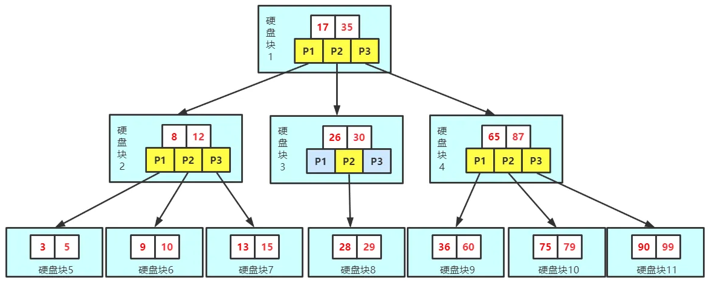

# 索引

## 目录

## 一、定义

索引是对数据库表中一列或多列的值进行排序的一种结构，使用索引可快速访问数据库表中的特定信息。如果想按特定职员的姓来查找他或她，则与在表中搜索所有的行相比，索引有助于更快地获取信息。

索引的一个主要目的就是加快检索表中数据，亦即能协助信息搜索者尽快的找到符合限制条件的记录ID的辅助数据结构。

## 二、优缺点

优点：

大大加快数据检索的速度。

将随机I/O变成顺序I/O(因为B+树的叶子节点是连接在一起的).

加速表与表之间的连接

缺点：

从空间角度考虑，建立索引需要占用物理空间.

从时间角度 考虑，创建和维护索引都需要花费时间，例如对数据进行增删改的时候都需要维护索引。

## 三、索引的数据结构

索引的数据结构主要有B+树和哈希表，对应的索引分别为B+树索引和哈希索引。

（1）B+树

B+树的索引又可以分为主索引和辅助索引。其中主索引为聚簇索引，辅助索引为非聚簇索引。聚簇索引是以主键作为B+ 树索引的键值所构成的B+树索引，聚簇索引的叶子节点存储着完整的数据记录；非聚簇索引是以非主键的列作为B+树索引的键值所构成的B+树索引，非聚簇索引的叶子节点存储着主键值。所以使用非聚簇索引进行查询时，会先找到主键值，然后到根据聚簇索引找到主键对应的数据域。

数据库为什么使用B+树而不是B树？

B树适用于随机检索，而B+树适用于随机检索和顺序检索。

B+树的空间利用率更高，因为B树每个节点要存储键和值，而B+树的内部节点只存储键，这样B+树的一个节点就可以存储更多的索引，从而使树的高度变低，减少了I/O次数，使得数据检索速度更快。

B+树的叶子节点都是连接在一起的，所以范围查找，顺序查找更加方便。

B+树的性能更加稳定，因为在B+树中，每次查询都是从根节点到叶子节点，而在B树中，要查询的值可能不在叶子节点，在内部节点就已经找到。

（2）哈希索引

因为两者数据结构上的差异导致它们的使用场景也不同，哈希索引一般多用于精确的等值查找，B+索引则多用于除了精确的等值查找外的其他查找。在大多数情况下，会选择使用B+树索引。

缺点：

哈希索引不支持排序，因为哈希表是无序的。

哈希索引不支持范围查找。

哈希索引不支持模糊查询及多列索引的最左前缀匹配。

因为哈希表中会存在哈希冲突，所以哈希索引的性能是不稳定的，而B+树索引的性能是相对稳定的，每次查询都是从根节点到叶子节点。

## 四、索引的类型

FULLTEXT即全文索引，MyISAM存储引擎和InnoDB存储引擎在MySQL5.6.4以上版本支持全文索引，一般用于查找文本中的关键字，而不是直接比较是否相等，多在CHAR，VARCHAR，TAXT等数据类型上创建全文索引。全文索引主要是用来解决WHERE name LIKE "%zhang%"等针对文本的模糊查询效率低的问题。

HASH即哈希索引，哈希索引多用于等值查询，时间复杂夫为o(1)，效率非常高，但不支持排序、范围查询及模糊查询等。

BTREE即B+树索引，INnoDB存储引擎默认的索引，支持排序、分组、范围查询、模糊查询等，并且性能稳定。

RTREE即空间数据索引，多用于地理数据的存储，相比于其他索引，空间数据索引的优势在于范围查找。

## 五、索引的种类

主键索引：数据列不允许重复，不能为NULL，一个表只能有一个主键索引。

组合索引：由多个列值组成的索引。

唯一索引：数据列不允许重复，可以为NULL，索引列的值必须唯一的，如果是组合索引，则列值的组合必须唯一。

全文索引：对文本的内容进行搜索。

普通索引：基本的索引类型，可以为NULL。

## 六、聚簇索引和非聚簇索引

聚簇索引：将数据和索引放到一起存储，索引结构的叶子节点保留了数据行。

非聚簇索引：将数据进和索引分开存储，索引叶子节点存储的是指向数据行的地址。

在InnoDB存储引擎中，默认的索引为B+树索引，利用主键创建的索引为主索引，也是聚簇索引，在主索引之上创建的索引为辅助索引，也是非聚簇索引。

在MyISAM存储引擎中，默认的索引也是B+树索引，但主索引和辅助索引都是非聚簇索引，也就是说索引结构的叶子节点存储的都是一个指向数据行的地址。

## 七、使用场景

对于中大型表建立索引非常有效，对于非常小的表，一般全部表扫描速度更快些。

对于超大型的表，建立和维护索引的代价也会变高，这时可以考虑分区技术。

如何表的增删改非常多，而查询需求非常少的话，那就没有必要建立索引了，因为维护索引也是需要代价的。

一般不会出现在where条件中的字段就没有必要建立索引了。

多个字段经常被查询的话可以考虑联合索引。

字段多且字段值没有重复的时候考虑唯一索引。

字段多且有重复的时候考虑普通索引。

## 八、设计原则

最适合索引的列是在where后面出现的列或者连接句子中指定的列，而不是出现在SELECT关键字后面的选择列表中的列。

索引列的基数越大，索引的效果越好，换句话说就是索引列的区分度越高，索引的效果越好。比如使用性别这种区分度很低的列作为索引，效果就会很差，因为列的基数最多也就是三种，大多不是男性就是女性。

尽量使用短索引，对于较长的字符串进行索引时应该指定一个较短的前缀长度，因为较小的索引涉及到的磁盘I/O较少，并且索引高速缓存中的块可以容纳更多的键值，会使得查询速度更快。

尽量利用最左前缀。

不要过度索引，每个索引都需要额外的物理空间，维护也需要花费时间，所以索引不是越多越好。

## 九、索引优化

对索引的优化其实最关键的就是要符合索引的设计原则和应用场景，将不符合要求的索引优化成符合索引设计原则和应用场景的索引。

在进行查询时，索引列不能是表达式的一部分，也不能是函数的参数，因为这样无法使用索引。例如select * from table_name where a + 1 = 2。

将区分度最高的索引放在前面。

尽量少使用select*。

## 十、语法

使用CREATE INDEX 语句：

    CREATE INDEX index_name ON table_name (column_list);

在CREATE TABLE时创建：

    CREATE TABLE user(
        id INT PRIMARY KEY,
        information text,
        FULLTEXT KEY (information)
    );

使用ALTER TABLE创建索引：

    ALTER TABLE table_name ADD INDEX index_name (column_list);

删除主键索引：

    alter table 表名 drop primary key

删除其他索引：

    alter table 表名 drop key 索引名

## 十一、使用索引查询时性能一定会提升吗？

不一定，前面在索引的使用场景和索引的设计原则中已经提到了如何合理地使用索引，因为创建和维护索引需要花费空间和时间上的代价，如果不合理地使用索引反而会使查询性能下降。

十二、前缀索引

前缀索引是指对文本或者字符串的前几个字符建立索引，这样索引的长度更短，查询速度更快。

使用场景：前缀的区分度比较高的情况下。

建立前缀索引的方式

    ALTER TABLE table_name ADD KEY(column_name(prefix_length));

这里面有个prefix_length参数很难确定，这个参数就是前缀长度的意思。通常可以使用以下方法进行确定，先计算全列的区分度

    SELECT COUNT(DISTINCT column_name) / COUNT(*) FROM table_name;

然后在计算前缀长度为多少时和全列的区分度最相似。

    SELECT COUNT(DISTINCT LEFT(column_name, prefix_length)) / COUNT(*) FROM table_name;

不断地调整prefix_length的值，直到和全列计算出区分度相近。

十三、最左匹配原则

最左匹配原则：从最左边为起点开始连续匹配，遇到范围查询（<、>、between、like）会停止匹配。

例如建立索引(a,b,c)，大家可以猜测以下几种情况是否用到了索引。

第一种

    select * from table_name where a = 1 and b = 2 and c = 3 
    select * from table_name where b = 2 and a = 1 and c = 3
上面两次查询过程中所有值都用到了索引，where后面字段调换不会影响查询结果，因为MySQL中的优化器会自动优化查询顺序。

第二种

    select * from table_name where a = 1
    select * from table_name where a = 1 and b = 2  
    select * from table_name where a = 1 and b = 2 and c = 3
答案是三个查询语句都用到了索引，因为三个语句都是从最左开始匹配的。

第三种

    select * from table_name where  b = 1 
    select * from table_name where  b = 1 and c = 2 
答案是这两个查询语句都没有用到索引，因为不是从最左边开始匹配的

第四种

    select * from table_name where a = 1 and c = 2 
这个查询语句只有a列用到了索引，c列没有用到索引，因为中间跳过了b列，不是从最左开始连续匹配的。

第五种

    select * from table_name where  a = 1 and b < 3 and c < 1
这个查询中只有a列和b列使用到了索引，而c列没有使用索引，因为根据最左匹配查询原则，遇到范围查询会停止。

第六种

    select * from table_name where a like 'ab%'; 
    select * from table_name where  a like '%ab'
    select * from table_name where  a like '%ab%'
对于列为字符串的情况，只有前缀匹配可以使用索引，中缀匹配和后缀匹配只能进行全表扫描。

十四、索引在什么情况下会失效？

在上面介绍了几种不符合最左匹配原则的情况会导致索引失效，除此之外，以下这几种情况也会导致索引失效。

条件中有or，例如select * from table_name where a = 1 or b = 3

在索引上进行计算会导致索引失效，例如select * from table_name where a + 1 = 2

在索引的类型上进行数据类型的隐形转换，会导致索引失效，例如字符串一定要加引号，假设 select * from table_name where a = '1'会使用到索引，如果写成select * from table_name where a = 1则会导致索引失效。

在索引中使用函数会导致索引失效，例如select * from table_name where abs(a) = 1

在使用like查询时以%开头会导致索引失效

索引上使用！、=、<>进行判断时会导致索引失效，例如select * from table_name where a != 1

索引字段上使用 is null/is not null判断时会导致索引失效，例如select * from table_name where a is null